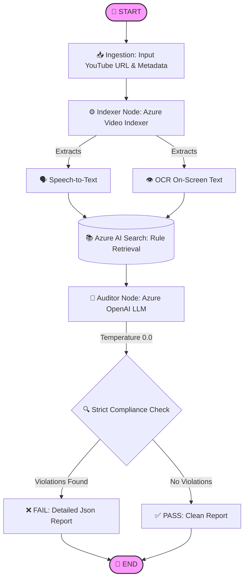

# 🛡️ Brand Guardian AI - Compliance QA Pipeline

## 🌟 Overview
Brand Guardian AI is a state-of-the-art **Video Compliance Audit Pipeline** designed to automate the process of verifying marketing videos against strict regulatory and brand guidelines. Instead of relying on manual reviewers to painstakingly review videos, this system leverages LangGraph, Azure Video Indexer, and Azure OpenAI to ingest, index, evaluate, and report compliance violations with high consistency and reliability.

By combining audio transcription (Speech-to-Text) and on-screen text recognition (OCR), the system ensures both spoken and written claims in videos adhere strictly to official regulatory rules.

## ⚙️ The Workflow Pipeline
The heart of the application is an orchestration graph (Directed Acyclic Graph) built using **LangGraph**. The workflow comprises the following sequential steps:



1. **📥 Ingestion (`[START]`)**:
   - The user inputs a YouTube video URL and its metadata into the system.
   - The application manages the input state using a predefined schema (`VideoAuditState`).
2. **⚙️ Indexing (`[indexer_node]`)**:
   - Downloads the target video.
   - Uploads to **Azure Video Indexer**, which extracts the video's transcript (Speech-to-Text) and capturing on-screen wording (OCR).
3. **📚 Retrieval**:
   - Consolidates the transcript and OCR text.
   - Uses **Azure AI Search** to perform a Semantic Vector Search (RAG - Retrieval-Augmented Generation) across a knowledge base.
   - Retrieves the most relevant regulatory rules given the context of what's said and shown in the video.
4. **🧠 Auditing (`[auditor_node]`)**:
   - Passes the extracted context and the retrieved regulatory guidelines to a Senior Brand Compliance Auditor LLM (**Azure OpenAI / GPT**).
   - Generates a carefully reasoned report that outputs structured JSON specifying exactly whether the video gets a `PASS` or `FAIL`.
   - Populates detailed `compliance_results` with severity flags (`CRITICAL`, etc.) and descriptions whenever a rule is violated.
5. **📝 Output (`[END]`)**:
   - The simulation CLI pretty-prints a detailed, structured Compliance Audit Report.

## 🎯 Precision, Accuracy, and Key Improvements

### 💡 What is the Precision of this System?
**Precision** in this context refers to the system’s ability to flag *actual* violations without flooding the user with false positives. 
* **RAG-Grounded Audits:** Traditional LLMs often "hallucinate" rules or apply general knowledge when evaluating content. In this system, precision is driven through RAG. The system retrieves *only the official, factual rules* from the Azure AI Vector Store prior to auditing, and strictly instructs the LLM with `temperature=0.0` to reason based *solely* on these retrieved rules.
* **Strict Schema Outputs:** Because the LLM outputs strict JSON mapped to categories and severity levels, there is practically zero ambiguity in deciding when and why a clause is violated.

### 🎯 What is the Accuracy of this System?
**Accuracy** measures how well the pipeline captures the true content of the video and applies reasoning without dropping critical information.
* **Multi-Modal Data Extraction:** The accuracy of the context is guaranteed by utilizing industrial-grade Azure Video Indexer to pull both the spoken word (Transcription) and the on-screen visuals (OCR). If a video verbally complies but shows a non-compliance disclaimer on-screen, the pipeline catches it.
* **Deterministic LLM Output**: Setting the Azure OpenAI temperature to `0.0` limits creative hallucinations, allowing for reliable, factual, and perfectly reproducible accuracy in standardizing brand audits.

### 🚀 Important Improvements over Manual Processes
1. **⚡ Automation & Speed:** Manual auditors spend hours pausing, rewinding, and scanning rulebooks. The AI parses the transcript, pulls the precise regulation needed, and flags the timestamp or text context in minutes.
2. **🧠 Reduced Cognitive Overload:** The system pre-filters massive rulebooks down to the top-3 most relevant rules per query.
3. **📊 Structured & Actionable Outputs:** Generating machine-readable JSON payloads automatically connects the Audit pipeline to backend databases, analytics dashboards, and automatic email notifications.
4. **🛡️ Robust Error Handling:** The graph handles "No Transcript" scenarios cleanly, halting gracefully without wasting compute or producing false passes. 

## 🛠️ Technology Stack
- **LangGraph & LangChain:** For state management and graph-based workflow execution.
- **Azure Search (Vector Database):** Stores and retrieves semantic embeddings of the Brand/Regulatory Rulebook.
- **Azure OpenAI:** For generating text embeddings (`text-embedding-3-small`) and reasoned compliance audits (`gpt-style` deployment).
- **Azure Video Indexer:** For Speech-to-Text (STT) and Optical Character Recognition (OCR).
- **Python Libraries:** Built on Python `^3.12` utilizing `fastapi`, `streamlit`, `pydantic`, `yt-dlp` (for YouTube extraction), and `opentelemetry` for execution tracing.

## 🏃 How to Run

1. **Setup Environment**:
   Ensure you have configured your environment variables inside the `.env` file (e.g., `AZURE_OPENAI_API_KEY`, `AZURE_SEARCH_ENDPOINT`, etc.).
   
2. **Start the workflow**:
   ```bash
   python main.py
   ```
   
   Running `main.py` directly will trigger the `run_cli_simulation()`, which downloads a demonstration YouTube URL, indexes it, identifies the relevant rules, queries the LLM Auditor, and prints a final formatted report to standard output.
